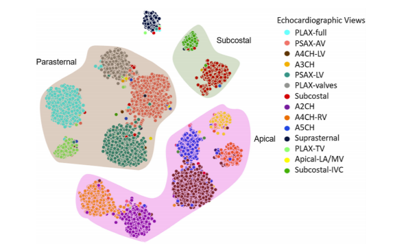
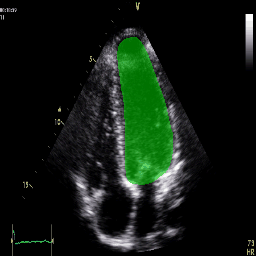
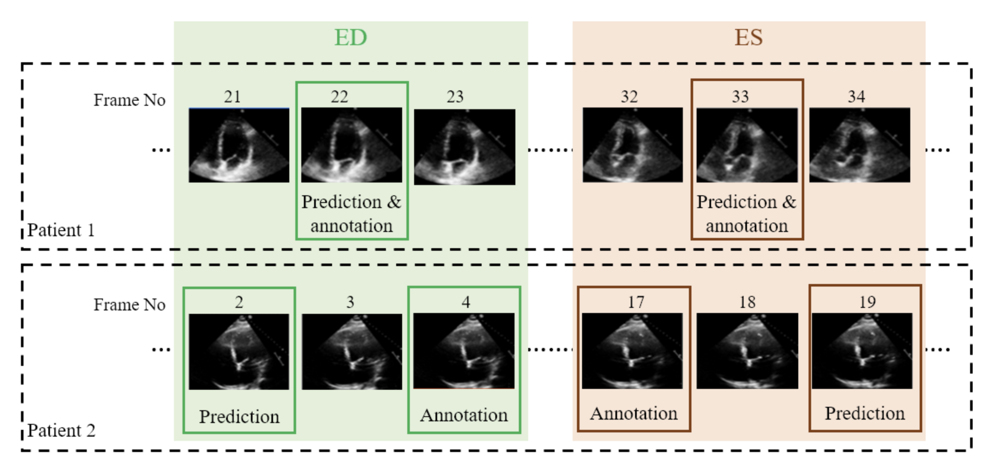

# EchoForge

**EchoForge** is a modular deep learning library built for echocardiographic image analysis. It provides seamless access to pretrained models for classification and segmentation, and will expand to include landmark detection, image quality assessment, and more.

The library is built using TensorFlow/Keras and integrates with models hosted on Hugging Face. It is designed for researchers, clinicians, and ML developers working with cardiac ultrasound imaging.


**From View Classification to Segmentation and Timing Detection — All in One Library**

#### View Classification  


#### LV Segmentation  


#### Phase Detection (ED vs ES Labelling)  



---

## 🔧 Features

- Pretrained model access (Hugging Face integration)
- Modular and scalable model zoo
- Supports both private and public Hugging Face repositories
- Central `load_model()` interface for dynamic loading
- Architecture-ready for classification, segmentation, landmarking, and timing estimation
- Caches downloaded models locally to avoid repeated downloads

---
<!-- 
## 📦 Installation

```bash
git clone https://github.com/intsav/EchoForge.git
cd EchoForge
pip install -e .
``` -->
## 📦 Installation

EchoForge can be installed in two ways depending on your workflow:  
a standard local installation, or installation inside a TensorFlow Docker/Jupyter environment.

---

### 🔧 Standard Installation (Local / Virtual Environment)

Use this option if you are installing EchoForge on your own machine or in a Python virtual environment.

```bash
git clone https://github.com/thrive-centre/EchoForge.git
cd EchoForge
pip install -e .
```
This installs EchoForge in editable mode, allowing you to update the source code and test changes instantly.

## 🐋 Installation Inside a TensorFlow Docker (GPU + Jupyter)

If you're running EchoForge inside a TensorFlow Docker container such as:

```bash
tensorflow/tensorflow:2.13.0-gpu-jupyter
```

then install it using the following commands inside your notebook or container terminal:

```bash
# Clone the EchoForge repository
!git clone https://github.com/thrive-centre/EchoForge.git

# Install EchoForge from the mounted directory
!pip install -e /tf/notebooks/EchoForge
```

>Note:
Update the path /tf/notebooks/EchoForge if your directory structure differs.
This is simply where your repo is located inside the container.
---

## Importing The Model 

```python
from echoforge import load_model

# Load any model by name from the registry
model = load_model("EchoView47_classifier", pretrained=True)
```
---

## 🧾 Current Model Portfolio
- Classification [*View our classification module*](echoforge/classification/README.md)
- Segmentation [*View our segmentation module*](echoforge/segmentation/README.md)
- Phase Detection [*View our phase detection module*](echoforge/phasedetection/README.md)


---

## 👥 Credits

- Developed by: **THRIVE Centre**
- Research Group: **Intelligent Sensing and Vision**
- Clinical Collaboration: **Faculty of Medicine, Imperial College London**

---

## 📎 Notes

- All models are downloaded once and cached in `~/.echoforge/models/`
- You can load models without pretrained weights for retraining
- Future versions will include `torch` support and ONNX export